<!-- Profile README · KolonX theme · assets generated by build_assets.py -->

  <a href="https://www.kolonx.com"></a>

  I’m the founder of <a href="https://www.kolonx.com">KolonX</a>, an engineering partner for teams that need software done properly. 
  I work across the Apple ecosystem and the systems underneath it: native iOS and macOS apps, SaaS platforms, 
  and the architecture that keeps them fast, secure and maintainable as the business grows.

  <a href="https://www.kolonx.com/#contact"><picture><source media="(prefers-color-scheme: dark)" srcset="assets/btn-kolonx-dark.svg"></picture></a>
  <!-- LINKEDIN <a href="https://www.linkedin.com/in/REPLACE_ME"><picture><source media="(prefers-color-scheme: dark)" srcset="assets/btn-linkedin-dark.svg"></picture></a> -->

 

<picture><source media="(prefers-color-scheme: dark)" srcset="assets/h-services-dark.svg"></picture>

  <picture><source media="(prefers-color-scheme: dark)" srcset="assets/services-dark.svg">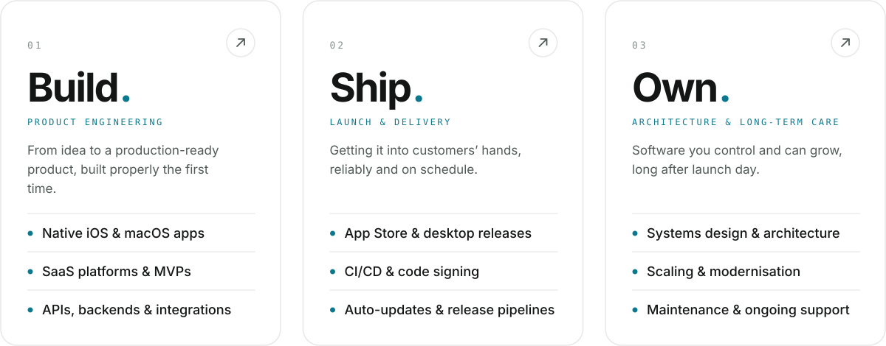</picture>

 

<picture><source media="(prefers-color-scheme: dark)" srcset="assets/h-work-dark.svg"></picture>

  <a href="https://github.com/SyedAliMasoodBukhari/Samedesk"><picture><source media="(prefers-color-scheme: dark)" srcset="assets/card-samedesk-dark.svg">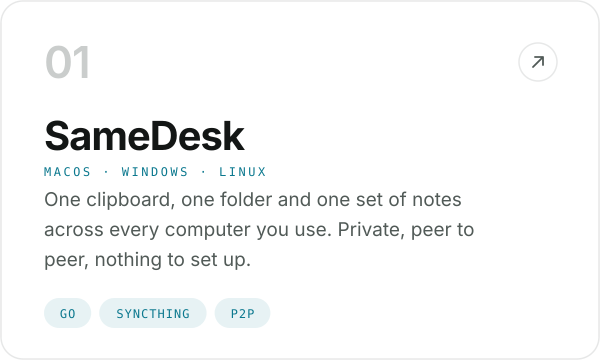</picture></a>
  <a href="https://github.com/SyedAliMasoodBukhari/LedgerDesktopApp-releases"><picture><source media="(prefers-color-scheme: dark)" srcset="assets/card-log-dark.svg">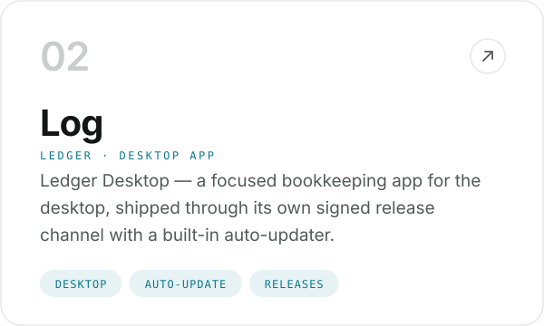</picture></a>

  <a href="https://github.com/SyedAliMasoodBukhari/SpeedometerGuage-SwiftUI"><picture><source media="(prefers-color-scheme: dark)" srcset="assets/card-speedometer-dark.svg">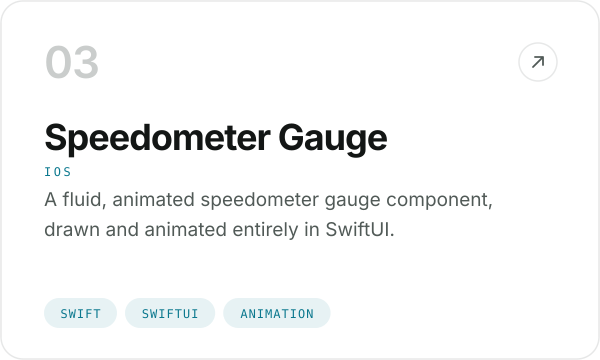</picture></a>
  <a href="https://github.com/SyedAliMasoodBukhari/LittleLemon-iOS"><picture><source media="(prefers-color-scheme: dark)" srcset="assets/card-littlelemon-dark.svg">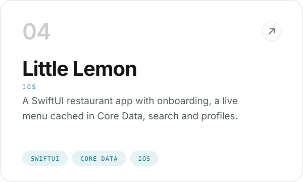</picture></a>

  <a href="https://github.com/SyedAliMasoodBukhari/Daira-InventoryManagementSystem"><picture><source media="(prefers-color-scheme: dark)" srcset="assets/card-daira-dark.svg">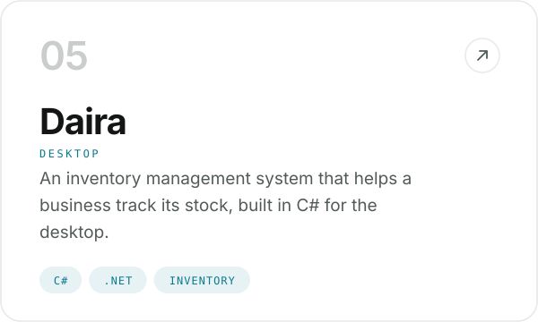</picture></a>
  <a href="https://github.com/SyedAliMasoodBukhari/ClassicalArabicPoems-ManagementSystem"><picture><source media="(prefers-color-scheme: dark)" srcset="assets/card-poems-dark.svg">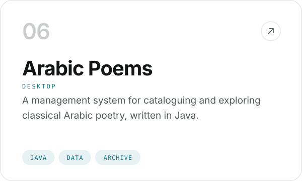</picture></a>

 

<picture><source media="(prefers-color-scheme: dark)" srcset="assets/h-stack-dark.svg"></picture>

  <picture><source media="(prefers-color-scheme: dark)" srcset="assets/stack-dark.svg">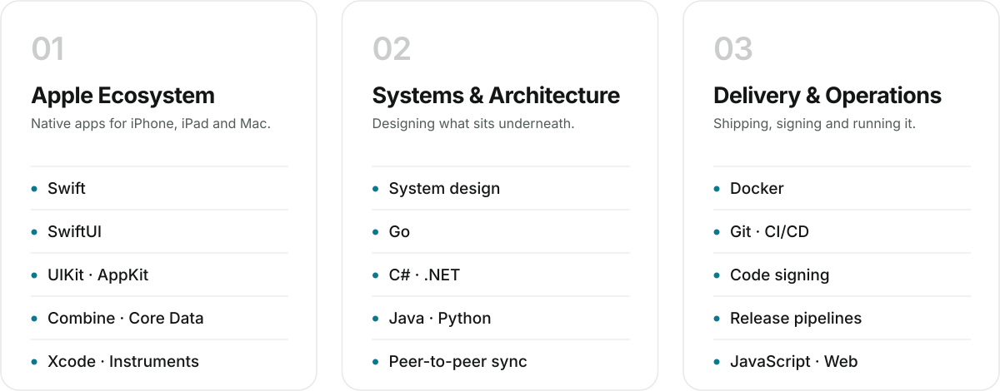</picture>

 

<picture><source media="(prefers-color-scheme: dark)" srcset="assets/h-now-dark.svg"></picture>

  <picture><source media="(prefers-color-scheme: dark)" srcset="assets/now-dark.svg">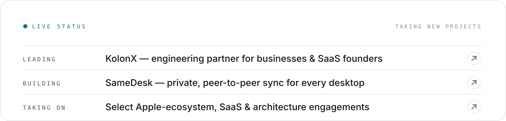</picture>

 

<picture><source media="(prefers-color-scheme: dark)" srcset="assets/h-activity-dark.svg"></picture>

  <picture>
    <source media="(prefers-color-scheme: dark)" srcset="https://raw.githubusercontent.com/SyedAliMasoodBukhari/SyedAliMasoodBukhari/output/snake-dark.svg">
    
  </picture>

 

  <a href="https://www.kolonx.com/#contact">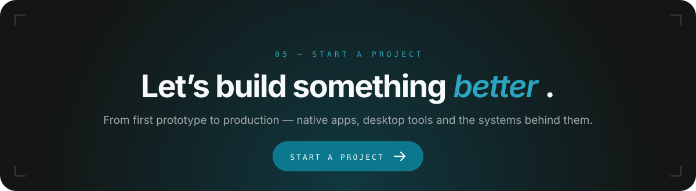</a>

  <a href="https://www.kolonx.com/#contact"><picture><source media="(prefers-color-scheme: dark)" srcset="assets/btn-kolonx-dark.svg"></picture></a>
  <!-- LINKEDIN <a href="https://www.linkedin.com/in/REPLACE_ME"><picture><source media="(prefers-color-scheme: dark)" srcset="assets/btn-linkedin-dark.svg"></picture></a> -->
  <a href="https://github.com/SyedAliMasoodBukhari?tab=repositories"><picture><source media="(prefers-color-scheme: dark)" srcset="assets/btn-github-dark.svg"></picture></a>

